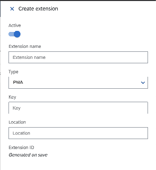

## How to create a PWA Native Extension for SAP Upscale Commerce

Native Extensions are capable of injecting native angular components and services directly into an application.
In addition to being visible to web-crawlers, these components will be able to interact directly with the PWA’s front end state and services, enabling the merchant to build essentially anything that an Upscale developer could.

To make it easier for a merchant to create a native extension, we have created a new public-facing upscale-web-storefront-sdk containing abstract classes which the component can access. The implementations of these classes exist as part of the PWA, and when the component is loaded, any references to them resolve to the implementations in the PWA.

Those services interact with the PWA state, and are what enable much of the complex functionality that a merchant would want.

The component can also access our caas-service-client-angular which provides services that interface directly with the back end services, for more fine-grained control.

### 1. Create Angular library

```sh
ng version
npm -v
ng new my-workspace --create-application=false
cd my-workspace
ng generate library custom-native-extension
```

See more details at https://angular.io/guide/creating-libraries

### 2. Install Upscale SDKs dependencies

Copy the `libs` folder from the root of a downloaded Upscale PWA App to the root of your workspace.
Run the following commands:
```sh
npm install
npm install --save-dev ./libs/upscale-service-client-angular-<version>.tgz
npm install --save-dev ./libs/upscale-web-storefront-sdk-<version>.tgz

npm install --save-dev @types/form-data
npm install --save-dev @types/big.js
```

Edit the file `projects/custom-native-extension/tsconfig.lib.json`
```json
{
  "compilerOptions": {
    // Add these 2 lines:
    "strictNullChecks": false,
    "noImplicitAny":false
  }
}
```

### 3. Register your custom component

Once you made all necessary changes to the Angular component under `projects/custom-native-extension/src/lib/custom-native-extension.component.ts`, you have to register it.

Open the file `projects/custom-native-extension/src/lib/custom-native-extension.module.ts`

Use `RegistrationService` to register your custom component from your Native Extension:
```typescript
import { NgModule } from '@angular/core';
import { CustomNativeExtensionComponent } from './custom-native-extension.component';
import { RegistrationService } from '@upscale/web-storefront-sdk';

@NgModule({
  declarations: [CustomNativeExtensionComponent],
  imports: [
  ],
  exports: [CustomNativeExtensionComponent]
})
export class CustomNativeExtensionModule {
  constructor(private registrationServices: RegistrationService,) {
    // the value 'my-custom-component' has to be defined used in Workbench as the Native Extension "Key"
    this.registrationServices.register('my-custom-component', CustomNativeExtensionComponent);
  }
}
```

### 4. Build and pack your Native Extension

Note: The build artifacts will be stored in the `dist/` directory.

```sh
npm run build custom-native-extension -- --configuration=production
npm pack ./dist/custom-native-extension
```

### 5. Publishing & hosting your Native Extension package

Host the generated tarball (.tgz) of your custom Native Extension in a public environment such as NPM, GitHub, or S3.

### 6. Configuration
1. Create a Native Extension in Workbench

Add the library as a Native Extension within the Workbench, similarly to how you would a style extension.

Location example for Workbench: `git+https://github.com/.../custom-native-extension-0.0.1.tgz`

For the Extension `Key` value, you must use the `id` value passed to `register(id, type)` in `custom-native-extension.module.ts`.

 

2. Assign Native Extension

In order to add the library to an app, select the Extension name in the selectize field for extensions within the app configuration.

 

> Note: You'll need to download the app to actually see the changes.

3. Configure Experience

Navigate to the Experience editor in Workbench for the Experience associated with the app. Add a Custom Component to a Template.
In the custom component configuration, enter the Extension ID and a component identifier corresponding to the mapping done in `custom-native-extension.module.ts` file. Hit save. 

 

### 7. Installation & Testing
When all of the above setup are complete, please follow the steps below to test your new Native Extension.

1. Download the PWA app.

2. Extract the contents of the zip.

3. Access the project root in terminal and run "npm install"  
 > NOTE: There is a known issue with NPM 7's handling of peer-deps. If using 7 run "npm install --legacy-peer-deps"

4. Access the application via localhost:4200. 
    - Eagerly loaded services from the Native Extension should be running. 
    - Components registered in the Native Extension, and configured to your Experience, should be visible/

Note: Alternatively to 1), you can directly add the new Custom Native Extension manually to your PWA by following this example:
```typescript
// Note: these changes are not necessary if you downloaded PWA from Workbench after assigning it your Custom Native Extension.
// Edit the PWA package.json file (under "dependencies") to add your Custom Native Extension:
{
    ...
    "custom-native-extension": "file:path/to/custom-native-extension-0.0.1.tgz",
}
// Open the `src/app/core/extension.module.ts` in your IDE and add the following import:
import { CustomNativeExtensionModule } from 'custom-native-extension';
// Add your Custom Native Extension in the modules:
const modules = [CustomNativeExtensionModule];
```

5. Install your custom native extension
```sh
npm i custom-native-extension
```

6. Start PWA locally
```sh
npm start
```

When doing changes to your Native Extension locally, you can see the changes simply by re-doing steps 4) Build, 5) Package, 8) Install and 9) Start PWA.

## How to obtain support

[Create an issue](https://github.com/SAP-samples/<repository-name>/issues) in this repository if you find a bug or have questions about the content.
 
For additional support, [ask a question in SAP Community](https://answers.sap.com/questions/ask.html).

## License
Copyright (c) 2021 SAP SE or an SAP affiliate company. All rights reserved. This project is licensed under the Apache Software License, version 2.0 except as noted otherwise in the [LICENSE](LICENSES/Apache-2.0.txt) file.
