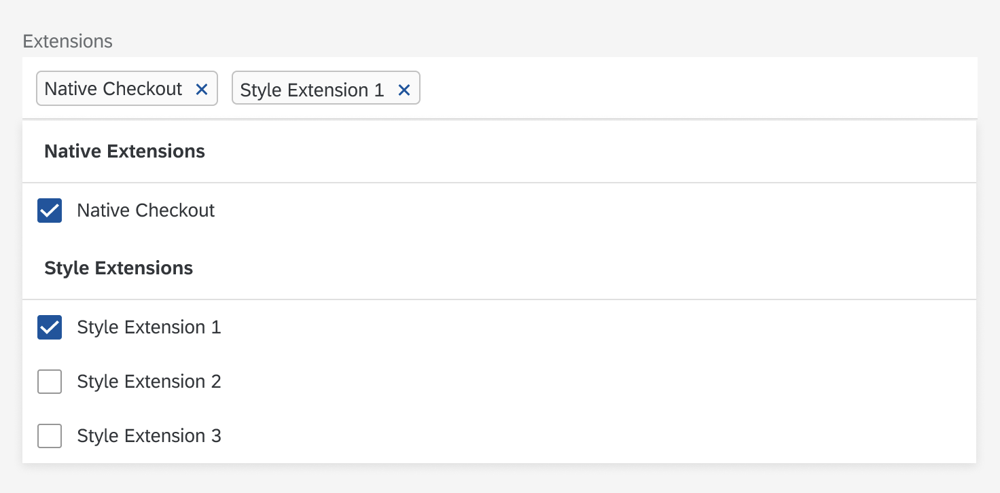

# SampleNativeExtension

This library was generated with [Angular CLI](https://github.com/angular/angular-cli) version 11.1.2.

## Code scaffolding

Run `ng generate component component-name --project sample-native-extension` to generate a new component. You can also use `ng generate directive|pipe|service|class|guard|interface|enum|module --project sample-native-extension`.
> Note: Don't forget to add `--project sample-native-extension` or else it will be added to the default project in your `angular.json` file. 

## Prebuild steps

1) Copy the `lib` folder from the root of a downloaded Upscale PWA App - to the root of "custom-component-samples". 
2) `npm install`
3) From root, `npm install ./libs/caas-service-client-angular-0.x.x.tgz`
4) From root `npm install ./libs/upscale-web-storefront-sdk-0.0.1-BETA.11.tgz`

## Build

  Run `ng build sample-native-extension` to build the project. The build artifacts will be stored in the `dist/` directory.

## Publishing

  After building your library with `ng build sample-native-extension`, go to the dist folder `cd dist/sample-native-extension` and run `npm publish` or `npm pack ./dist/sample-native-extension` to generate a tarball for hosting.

## Configuration
1. Create Native Extension

  Add the library as a Native Extension within the workbench, similarly to how you would a style extension.
   

2. Assign Native Extension

  In order to add the library to an app where you wish, select the extension name in the selectize field for extensions within the app configuration.
   

  > Note: You'll need to download the app to actually see the changes.

3. Configure Experience

  Navigate to the experience editor for the experience associated with the app. Add a Custom Component to a Template.

  In the custom component configuration, enter the extension ID and a component identifier corresponding to the mapping done in "sample-native-extension.module.ts". Hit save. 

   


## Installation & Testing
If all the above setup is complete, please follow the steps below to test your new native extension

1. Download the PWA app.

2. Extract the contents of the zip.

3. Access the project root in terminal and run "npm install"  
 > NOTE: There is a known issue with NPM 7's handling of peer-deps. If using 7 run "npm install --legacy-peer-deps"

4. Add the library module to your application:

    Open the file "src/app/core/extension.module.ts" in your ide/text editor
    Add the following to the first list of imports:
    
    ```
    import { UpscaleExtensionModule } from 'sample-native-extension';

    // Add Native Extension Modules here
    const modules = [
      UpscaleExtensionModule
    ];
    ```

5. Access the application via localhost:4200. 
    - Eagerly loaded services from the Native Extension should be running. 
    - Components registered in the Native Extension, and configured to your Experience, should be visible/

## How to obtain support

[Create an issue](https://github.com/SAP-samples/<repository-name>/issues) in this repository if you find a bug or have questions about the content.
 
For additional support, [ask a question in SAP Community](https://answers.sap.com/questions/ask.html).

## License
Copyright (c) 2021 SAP SE or an SAP affiliate company. All rights reserved. This project is licensed under the Apache Software License, version 2.0 except as noted otherwise in the [LICENSE](LICENSES/Apache-2.0.txt) file.
