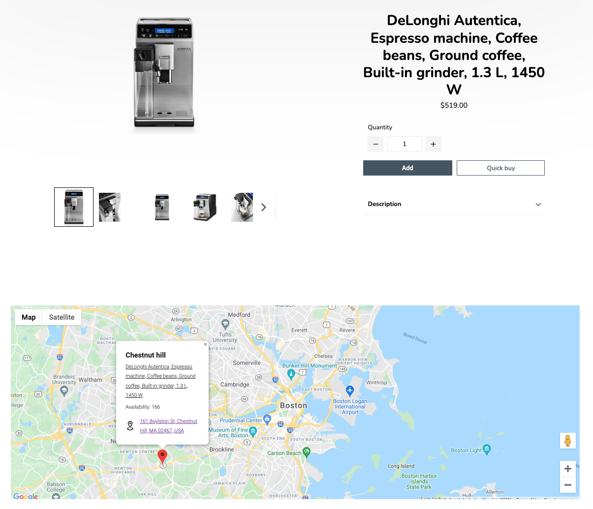
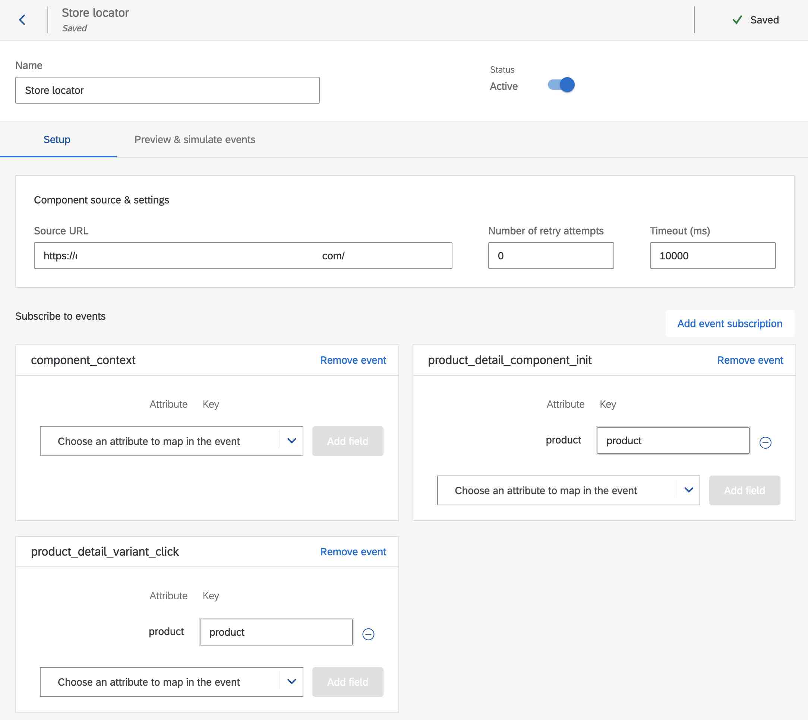

# Store Locator

## Dependencies & Configurations

1) Expect the Custom Component configuration in the Workbench to match this pictured config 
2) Expect a External Application to supply store and inventory information. The sample app (Java Springboot) is also published at https://github.com/SAP-samples/upscale-commerce-external-application.
	- Paste the URL of the app in `projects/store-locator/src/environments/environment.ts` & `src/environments.environment.prod.ts` (environments files)
3) Expect a Google API key to access the following APIs: "Geocoding API", "Maps Embed API", "Maps JavaScript"
	- Paste in the environments files
4) Expect an API for the External Application to verify. This can be anything but should match what the External App instance expects. 
	- Paste in the environments files

## Setup
This app can cover either of the two following use-cases:
1) Display all the Fulfillment Stores on a tenant
2) Display the inventory for a product by each Fulfillment Store on the tenant

To select a use-case: edit the "showInventoryMap" value in the environments files

## Deployment

Note - check your `manifest.yml` that the configured route matches the "origin" config in the External Application.
